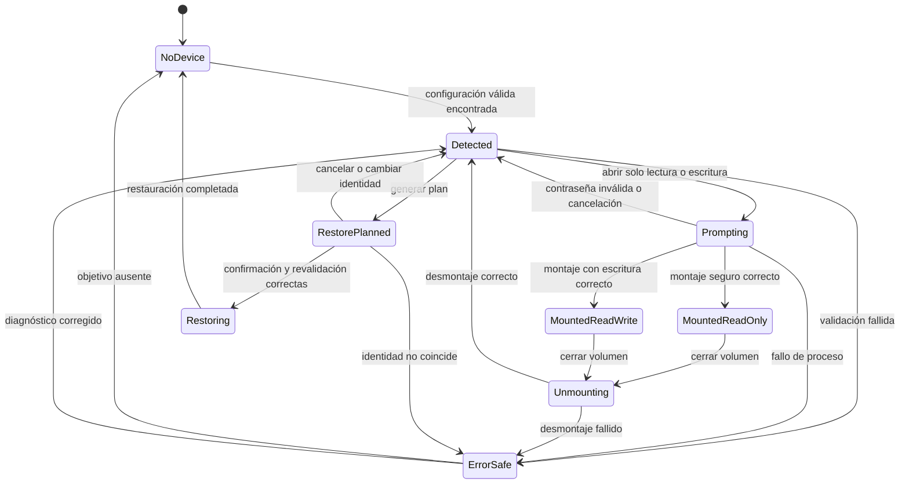

# Máquina de estados de Lethe

## Estados

| Estado | Descripción |
|---|---|
| `NoDevice` | No se encontró un objetivo Lethe válido. |
| `Detected` | Se encontró configuración y contenedor, aún sin montar. |
| `Prompting` | VeraCrypt está solicitando una contraseña. |
| `MountedReadOnly` | El volumen está montado sin escritura. |
| `MountedReadWrite` | El volumen está montado con escritura explícitamente habilitada. |
| `Unmounting` | Se solicitó el desmontaje y se espera su resultado. |
| `RestorePlanned` | Existe un plan ligado a una identidad exacta de dispositivo. |
| `Restoring` | El ayudante elevado está restaurando el dispositivo. |
| `ErrorSafe` | Ocurrió un error y no se autoriza una operación destructiva. |

## Transiciones principales

## Invariantes

1. `Prompting` no contiene ni registra la contraseña.
2. Solo `MountedReadWrite` permite escritura deliberada.
3. No se puede pasar directamente de un estado montado a `Restoring`.
4. `Restoring` requiere un `RestorePlanned` válido y una segunda lectura de identidad coincidente.
5. Cualquier ambigüedad en el dispositivo conduce a `ErrorSafe`.
6. Una contraseña inválida vuelve a `Detected`; nunca conduce a restauración o borrado.
